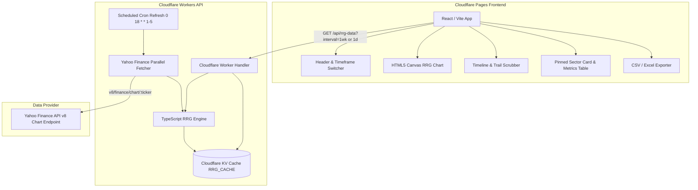

# RRG Indian Sectors Web Platform

A standalone high-performance web platform that computes and visualizes Relative Rotation Graphs (RRG) for National Stock Exchange (NSE) sector indices against the Nifty 50 benchmark (`^NSEI`), deployed on Cloudflare Pages and Cloudflare Workers.


---

## Key Features

- **Dual Timeframe Support (Weekly & Daily)**: Seamlessly toggle between Weekly multi-year sector rotation and Daily (1 Year) short-term sector rotation.
- **Causal Daily RRG EMA Smoothing**: Eliminates high-frequency daily market noise without lookahead bias using a 20-trading-day RS EMA + 5-trading-day RS-Momentum EMA.
- **Interactive Rotation Trails & Hover Stats**: Full historical playback animation, interactive trail point hover halos, and real-time metric tooltips (RS-Ratio, RS-Momentum, 4W/4D Forward Return, Date, Quadrant).
- **One-Click CSV / Excel Data Export**: Instant browser download of complete dataset observations for spreadsheet analysis.
- **14 Pure NSE Sector Indices**: Standardized, alphabetically sorted sector universe covering Auto, Bank, Energy, Fin Service, FMCG, Infra, IT, Media, Metal, Pharma, PSU Bank, Pvt Bank, Realty, and Services.
- **High-Contrast Dark Charcoal UI**: Custom OLED-friendly visual design system with clear section borders and responsive controls.

---

## Architecture Diagram



---

## Methodology & Calculation Engine

Relative Rotation Graphs (RRG), originally developed by Julius de Kempenaer (JdK), track the relative strength and momentum of multiple asset classes or industry sectors against a common benchmark index (**Nifty 50 / `^NSEI`**).

### 1. Weekly RRG Calculation (Unsmoothed)

1. **Relative Strength ($\text{RS}$)**:
   $$\text{RS}_t = \frac{\text{Price}_{\text{sector}, t}}{\text{Price}_{\text{benchmark}, t}}$$

2. **JdK RS-Ratio**:
   $$\text{RS-Ratio}_t = 100 + \text{z-score}_{14}\left(\text{RS}_t\right)$$
   where $\text{z-score}_{14}(x) = \frac{x - \mu_{14}}{\sigma_{14}}$, computed over a 14-period rolling window using population standard deviation ($\text{ddof} = 0$).

3. **JdK RS-Momentum**:
   $$\text{RS-Momentum}_t = 100 + \text{z-score}_{14}\left(\frac{\text{RS-Ratio}_t - \text{RS-Ratio}_{t-1}}{\text{RS-Ratio}_{t-1}}\right)$$

---

### 2. Daily RRG Calculation (Causal EMA Smoothing)

To reduce erratic day-to-day market noise while preserving responsiveness and avoiding lookahead bias:

$$\text{Raw Daily Prices} \rightarrow \text{Daily RS} \xrightarrow{\mathbf{\text{20D EMA}}} \text{Smoothed RS} \xrightarrow{\text{14D Z-Score}} \text{Daily RS-Ratio} \xrightarrow{\text{14D Z-Score of ROC}} \text{Raw RS-Mom} \xrightarrow{\mathbf{\text{5D EMA}}} \mathbf{\text{Plotted Coordinates}}$$

- **Causal EMA Formula**:
  $$\alpha = \frac{2}{\text{period} + 1}$$
  $$\text{EMA}_t = \alpha \cdot \text{value}_t + (1 - \alpha) \cdot \text{EMA}_{t-1}$$
  - Relative Strength EMA Period: **20 trading days** ($\alpha = 2/21$)
  - RS-Momentum EMA Period: **5 trading days** ($\alpha = 2/6$)
- **Chronological Execution**: Calculated forward in time without future observations.
- **Null Safety**: Invalid/pre-history entries cleanly reset EMA state without inventing zeroes or introducing lookahead bias.

---

### Quadrant Classification (Centered at 100, 100)

- **Leading (Green, Top-Right)**: $\text{RS-Ratio} \ge 100$ and $\text{RS-Momentum} \ge 100$ (Outperforming benchmark with positive momentum).
- **Weakening (Orange, Bottom-Right)**: $\text{RS-Ratio} \ge 100$ and $\text{RS-Momentum} < 100$ (Outperforming benchmark but losing momentum).
- **Lagging (Red, Bottom-Left)**: $\text{RS-Ratio} < 100$ and $\text{RS-Momentum} < 100$ (Underperforming benchmark with negative momentum).
- **Improving (Blue, Top-Left)**: $\text{RS-Ratio} < 100$ and $\text{RS-Momentum} \ge 100$ (Underperforming benchmark but gaining momentum).

---

## Forward Return Metric

The forward return metric measures the sector index's standalone performance 4 periods (4 weeks or 4 days) into the future from the selected date:
$$\text{Forward Return}_{t} = \frac{\text{Price}_{t+4} - \text{Price}_t}{\text{Price}_t}$$

> **Disclaimer:** Forward returns are strictly historical and descriptive of past performance; they are not predictive nor intended as financial forecasts.

---

## API Documentation

### `GET /api/rrg-data`

Retrieves calculated RRG metrics for all sector indices.

#### Query Parameters:
- `interval` (optional): `1wk` (default, Weekly) or `1d` (Daily 1Y smoothed).
- `refresh` (optional): Set `true` to force a cache refresh against Yahoo Finance.

#### Response Structure:
```json
{
  "timeframe": "Daily",
  "interval": "1d",
  "dates": ["2025-09-19", ..., "2026-08-11"],
  "benchmark": "^NSEI",
  "sectors": ["^CNXAUTO", "^NSEBANK", ...],
  "metrics": {
    "^NSEBANK": {
      "sector": "^NSEBANK",
      "rsRatio": [98.49, ...],
      "rsMomentum": [100.63, ...],
      "forward4wReturn": [0.0459, ...]
    }
  },
  "updatedAt": "2026-08-11T19:41:48.000Z"
}
```

---

## Project Structure

```
rrg-indian-sectors-web/
├── worker/                  # Cloudflare Worker API & Math Engine
│   ├── src/
│   │   ├── index.ts         # Worker route handler & KV cache keys
│   │   ├── fetcher.ts       # Yahoo Finance API parallel fetcher
│   │   ├── rrg_engine.ts    # TypeScript RRG engine (Weekly & Daily 20D/5D EMA)
│   │   └── sectors.ts       # Alphabetically sorted sector index catalog
│   ├── __tests__/           # Vitest unit test suite
│   └── wrangler.toml        # Cloudflare Workers configuration
├── frontend/                # Cloudflare Pages React/Vite App
│   ├── src/
│   │   ├── components/      # Canvas chart, scrubber, detail panel, header
│   │   ├── utils/           # CSV / Excel export generator
│   │   ├── App.tsx          # Main React container
│   │   └── index.css        # OLED dark theme design system
├── scripts/                 # Math precision verification tools
│   ├── generate_ref_data.py # Reference Python computation exporter (pandas.ewm)
│   ├── verify_math.ts       # TS vs Python 11-decimal precision comparison
│   └── test_sector_tickers.ts # Yahoo Finance ticker validator
└── .github/workflows/       # Automated CI pipeline
    └── ci.yml
```

---

## Local Development & Testing

1. **Install Dependencies**:
   ```bash
   npm install
   cd frontend && npm install
   ```

2. **Run Math Precision Verification**:
   ```bash
   python scripts/generate_ref_data.py
   npm run verify-math
   ```

3. **Run Unit Test Suite**:
   ```bash
   npm test
   ```

4. **Start Frontend Dev Server**:
   ```bash
   cd frontend
   npm run dev
   ```

5. **Build Production Bundle**:
   ```bash
   cd frontend
   npm run build
   ```

---

## Deployment Instructions

### Cloudflare Worker (Backend API)
```bash
cd worker
npx wrangler deploy
```

### Cloudflare Pages (Frontend)
```bash
cd frontend
npm run build
npx wrangler pages deploy dist
```
