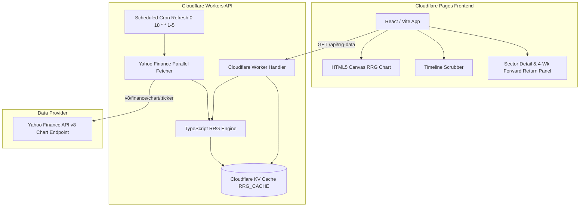

# RRG Indian Sectors Web Platform

A standalone high-performance web platform that computes and visualizes Relative Rotation Graphs (RRG) for National Stock Exchange (NSE) sector indices against the Nifty 50 benchmark (`^NSEI`), deployed on Cloudflare Pages and Cloudflare Workers.


---

## Architecture Diagram



---

## Methodology

Relative Rotation Graphs (RRG), originally developed by Julius de Kempenaer (JdK), track the relative strength and momentum of multiple asset classes or industry sectors against a common benchmark index (in this platform, **Nifty 50 / `^NSEI`**).

### Formulas

1. **Relative Strength ($\text{RS}$)**:
   $$\text{RS}_t = \frac{\text{Price}_{\text{sector}, t}}{\text{Price}_{\text{benchmark}, t}}$$

2. **JdK RS-Ratio**:
   $$\text{RS-Ratio}_t = 100 + \text{z-score}_{14}\left(\text{RS}_t\right)$$
   where $\text{z-score}_{14}(x) = \frac{x - \mu_{14}}{\sigma_{14}}$, computed over a 14-period rolling window using population standard deviation ($\text{ddof} = 0$).

3. **JdK RS-Momentum**:
   $$\text{RS-Momentum}_t = 100 + \text{z-score}_{14}\left(\frac{\text{RS-Ratio}_t - \text{RS-Ratio}_{t-1}}{\text{RS-Ratio}_{t-1}}\right)$$

### Quadrant Classification (Centered at 100, 100)
- **Leading (Green, Top-Right)**: $\text{RS-Ratio} \ge 100$ and $\text{RS-Momentum} \ge 100$ (Outperforming benchmark with positive momentum).
- **Weakening (Yellow, Bottom-Right)**: $\text{RS-Ratio} \ge 100$ and $\text{RS-Momentum} < 100$ (Outperforming benchmark but losing momentum).
- **Lagging (Red, Bottom-Left)**: $\text{RS-Ratio} < 100$ and $\text{RS-Momentum} < 100$ (Underperforming benchmark with negative momentum).
- **Improving (Blue, Top-Left)**: $\text{RS-Ratio} < 100$ and $\text{RS-Momentum} \ge 100$ (Underperforming benchmark but gaining momentum).

---

## Next 1-Month Return Feature

The 4-week forward return metric measures the sector index's own standalone price return 4 weeks following the selected historical date:
$$\text{Forward Return}_{t} = \frac{\text{Price}_{t+4} - \text{Price}_t}{\text{Price}_t}$$

> **Disclaimer:** The forward 1-month return metric is strictly historical and descriptive of past performance; it is not predictive nor intended as a financial forecast.

---

## Project Structure

```
rrg-indian-sectors-web/
├── worker/                  # Cloudflare Worker API & Math Engine
│   ├── src/
│   │   ├── index.ts         # Worker route handler & KV cache
│   │   ├── fetcher.ts       # Yahoo Finance API parallel fetcher
│   │   ├── rrg_engine.ts    # TypeScript engine matching pandas rolling z-score
│   │   └── sectors.ts       # Empirically verified sector index ticker catalog
│   ├── __tests__/           # Vitest unit tests
│   └── wrangler.toml        # Cloudflare configuration
├── frontend/                # Cloudflare Pages React/Vite App
│   ├── src/
│   │   ├── components/      # Canvas chart, scrubber, detail panel
│   │   ├── App.tsx          # Main React layout
│   │   └── index.css        # Dark theme design system
├── scripts/                 # Math precision verification tools
│   ├── generate_ref_data.py # Reference Python computation exporter
│   ├── verify_math.ts       # TS vs Python 12-decimal precision comparison
│   └── test_sector_tickers.ts # Empirical Yahoo Finance ticker validator
└── .github/workflows/       # Automated CI pipeline
    └── ci.yml
```

---

## Local Development & Testing

1. **Install Dependencies**:
   ```bash
   npm install
   cd frontend && npm install
   ```

2. **Run Math Precision Verification**:
   ```bash
   python scripts/generate_ref_data.py
   npm run verify-math
   ```

3. **Run Unit Tests**:
   ```bash
   npm test
   ```

4. **Start Frontend Dev Server**:
   ```bash
   cd frontend
   npm run dev
   ```

---

## Deployment Instructions

### Cloudflare Worker (Backend API)
```bash
cd worker
npx wrangler deploy
```

### Cloudflare Pages (Frontend)
```bash
cd frontend
npm run build
npx wrangler pages deploy dist
```
