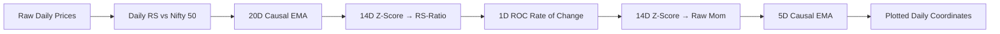
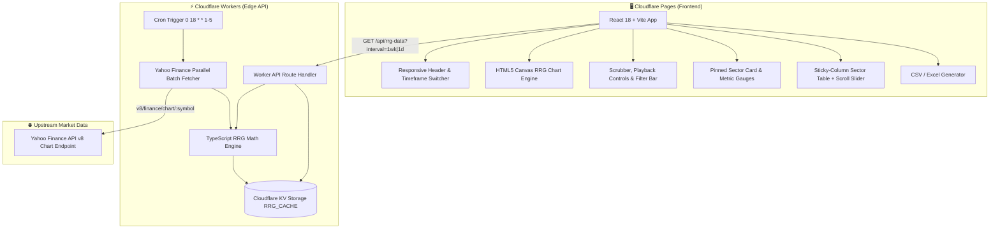

<div align="center">

# 📊 RRG India · NSE Sector Rotation Platform

**High-performance Relative Rotation Graph (RRG) analytics engine for Indian stock market sectors benchmarked against the Nifty 50 (`^NSEI`).**

[](https://github.com/VIJNESH200/rrg-indian-sectors-web/actions)
[](https://rrg-indian-sectors.pages.dev/)
[](https://workers.cloudflare.com/)
[](https://www.typescriptlang.org/)
[](https://reactjs.org/)
[](https://vitejs.dev/)
[](https://opensource.org/licenses/MIT)

[**🌐 Launch Live Application**](https://rrg-indian-sectors.pages.dev/) · [**📖 API Docs**](#-api-reference) · [**📐 Math Engine**](#-methodology--math-engine) · [**🚀 Quickstart**](#-quickstart--local-development)

</div>

---

## 📌 Table of Contents

- [Overview](#-overview)
- [Key Features](#-key-features)
- [RRG Quadrant Framework](#-rrg-quadrant-framework)
- [Methodology & Math Engine](#-methodology--math-engine)
  - [1. Weekly RRG (Unsmoothed)](#1-weekly-rrg-calculation-unsmoothed)
  - [2. Daily RRG (Causal 2-Stage EMA Smoothing)](#2-daily-rrg-calculation-causal-ema-smoothing)
  - [3. Forward Return Metric](#3-forward-period-return-metric)
- [Sector Universe (14 Pure NSE Indices)](#-sector-universe-14-pure-nse-indices)
- [System Architecture](#-system-architecture)
- [API Reference](#-api-reference)
- [Project Directory Structure](#-project-directory-structure)
- [Quickstart & Local Development](#-quickstart--local-development)
- [Cloudflare Deployment](#-cloudflare-deployment)
- [License & Disclaimer](#-license--disclaimer)

---

## 🌟 Overview

**RRG India** is a dedicated quantitative visualization tool designed to analyze sector rotation trends across the National Stock Exchange of India (NSE). By calculating rolling **RS-Ratio** (relative strength) and **RS-Momentum** (rate of change of relative strength) against the Nifty 50 benchmark index, market participants can identify which industrial sectors are leading, weakening, lagging, or improving in real time.

---

## ⚡ Key Features

| Feature | Description |
| :--- | :--- |
| **Dual Timeframe Engine** | Seamlessly toggle between **Weekly** multi-year macro rotation and **Daily (1Y)** tactical rotation. |
| **Causal Daily EMA Smoothing** | 2-stage EMA pipeline (20D RS EMA + 5D RS-Mom EMA) eliminates day-to-day market noise with **zero lookahead bias**. |
| **High-Precision HTML5 Canvas** | Custom GPU-accelerated canvas chart with dynamic collision-resolved labels, historical tails, and touch halos. |
| **Historical Time Travel** | Full scrubber timeline with playback controls (1×, 2×, 3× speed), step buttons, and trail adjustments (`4D/8D/12D/20D` & `4W/8W/12W/20W`). |
| **Mobile-First Responsiveness** | Fully optimized for mobile viewports ($375\text{px}-412\text{px}$) with viewport-clamped tooltips, horizontal pill scroll, sticky table columns, and synchronized scroll slider. |
| **One-Click CSV / Excel Export** | Download the complete calculated dataset for spreadsheet modeling and offline quant research. |
| **Edge-Cached Zero-Latency API** | Powered by Cloudflare Workers and KV Storage with automatic daily market-close cron refresh (`0 18 * * 1-5`). |

---

## 🧭 RRG Quadrant Framework

The RRG chart is centered on the benchmark baseline $(100, 100)$. Sectors rotate in a characteristic clockwise trajectory through four quadrants:

```
                  RS-Momentum (Y-Axis)
                           ▲
             IMPROVING     │     LEADING
         [Blue Quadrant]   │  [Green Quadrant]
         Bottom-Left to    │   Leading the market
          Top-Left Shift   │   with momentum
                           │
 ──◄───────────────────────┼───────────────────────►── RS-Ratio (X-Axis)
   100                     100                     100
                           │
             LAGGING       │    WEAKENING
          [Red Quadrant]   │ [Orange Quadrant]
         Underperforming   │  Outperforming but
          with downward    │  losing momentum
            momentum       │
                           ▼
```

| Quadrant | RS-Ratio | RS-Momentum | Market Interpretation | Tactical Implication |
| :--- | :---: | :---: | :--- | :--- |
| 🟢 **Leading** | $\ge 100$ | $\ge 100$ | Outperforming benchmark with positive momentum | Strongest sector group; ideal for overweighting |
| 🟠 **Weakening** | $\ge 100$ | $< 100$ | Outperforming benchmark but losing relative momentum | Mature uptrend; watch for exhaustion or rotation out |
| 🔴 **Lagging** | $< 100$ | $< 100$ | Underperforming benchmark with negative momentum | Weakest sector group; underperformers |
| 🔵 **Improving** | $< 100$ | $\ge 100$ | Underperforming benchmark but gaining upward momentum | Early-stage recovery; watch for potential leadership |

---

## 📐 Methodology & Math Engine

Relative Rotation Graphs, pioneered by **Julius de Kempenaer (JdK)**, normalize price series into standardized relative rotation coordinates.

### 1. Weekly RRG Calculation (Unsmoothed)

1. **Relative Strength ($\text{RS}$)**:
   $$\text{RS}_t = \frac{\text{Price}_{\text{sector}, t}}{\text{Price}_{\text{benchmark}, t}}$$

2. **JdK RS-Ratio (14-Period Rolling Z-Score)**:
   $$\text{RS-Ratio}_t = 100 + \left( \frac{\text{RS}_t - \mu_{14}(\text{RS})}{\sigma_{14}(\text{RS})} \right)$$
   *Computed over a 14-period rolling window using population standard deviation ($\text{ddof} = 0$, exact pandas parity).*

3. **JdK RS-Momentum (14-Period Rolling Z-Score of Rate of Change)**:
   $$\text{ROC}_t = \frac{\text{RS-Ratio}_t - \text{RS-Ratio}_{t-1}}{\text{RS-Ratio}_{t-1}}$$
   $$\text{RS-Momentum}_t = 100 + \left( \frac{\text{ROC}_t - \mu_{14}(\text{ROC})}{\sigma_{14}(\text{ROC})} \right)$$

---

### 2. Daily RRG Calculation (Causal EMA Smoothing)

Daily raw prices exhibit high-frequency microstructure noise that causes erratic day-to-day quadrant flipping. RRG India applies a dedicated **causal 2-stage Exponential Moving Average (EMA)** smoothing pipeline:



- **Causal EMA Formula**:
  $$\alpha = \frac{2}{\text{period} + 1}$$
  $$\text{EMA}_t = \alpha \cdot \text{value}_t + (1 - \alpha) \cdot \text{EMA}_{t-1}$$
  - **Stage 1 (Relative Strength EMA)**: $\text{period} = 20\text{ trading days} \implies \alpha = \frac{2}{21} \approx 0.0952$
  - **Stage 2 (RS-Momentum EMA)**: $\text{period} = 5\text{ trading days} \implies \alpha = \frac{2}{6} \approx 0.3333$
- **Mathematical Invariants**:
  - Strictly chronological: $\text{EMA}_t$ depends exclusively on current observation $v_t$ and prior state $\text{EMA}_{t-1}$.
  - Zero lookahead bias: verified against independent Python `pandas.Series.ewm(span=N, adjust=False)` to $11+$ decimal places.

---

### 3. Forward Period Return Metric

Standalone percentage price return $N$ periods into the future from the selected historical date:
$$\text{Forward Return}_{t} = \frac{\text{Price}_{t+4} - \text{Price}_t}{\text{Price}_t}$$

> [!NOTE]
> Forward returns are purely historical and descriptive of past performance; they are not predictive nor intended as financial forecasts.

---

## 🏛 Sector Universe (14 Pure NSE Indices)

The platform tracks 14 standardized National Stock Exchange (NSE) sector indices alphabetically:

| # | Index Name | Yahoo Finance Ticker | Category | Default Visibility |
| :-: | :--- | :--- | :-: | :-: |
| 1 | **Nifty Auto** | `^CNXAUTO` | Core | ✅ Active |
| 2 | **Nifty Bank** | `^NSEBANK` | Core | ✅ Active |
| 3 | **Nifty Energy** | `^CNXENERGY` | Expanded | ⚪ Off |
| 4 | **Nifty Financial Services** | `NIFTY_FIN_SERVICE.NS` | Expanded | ⚪ Off |
| 5 | **Nifty FMCG** | `^CNXFMCG` | Core | ✅ Active |
| 6 | **Nifty Infrastructure** | `^CNXINFRA` | Expanded | ⚪ Off |
| 7 | **Nifty IT** | `^CNXIT` | Core | ✅ Active |
| 8 | **Nifty Media** | `^CNXMEDIA` | Expanded | ✅ Active |
| 9 | **Nifty Metal** | `^CNXMETAL` | Core | ✅ Active |
| 10 | **Nifty Pharma** | `^CNXPHARMA` | Core | ✅ Active |
| 11 | **Nifty PSU Bank** | `^CNXPSUBANK` | Expanded | ⚪ Off |
| 12 | **Nifty Private Bank** | `NIFTY_PVT_BANK.NS` | Expanded | ⚪ Off |
| 13 | **Nifty Realty** | `^CNXREALTY` | Expanded | ✅ Active |
| 14 | **Nifty Services Sector** | `^CNXSERVICE` | Expanded | ⚪ Off |
| — | **Benchmark Index** | `^NSEI` (Nifty 50) | Benchmark | 🎯 Center (100, 100) |

---

## 🏗 System Architecture



---

## 📡 API Reference

### `GET /api/rrg-data`

Fetches computed RRG metrics and historical price time-series for all 14 sector indices.

#### Parameters:
| Query Param | Type | Default | Description |
| :--- | :---: | :---: | :--- |
| `interval` | `string` | `"1wk"` | Timeframe interval: `"1wk"` (Weekly unsmoothed) or `"1d"` (Daily 1Y smoothed). |
| `refresh` | `boolean` | `false` | Force live cache bypass and recalculate upstream data. |

#### Sample Request:
```bash
curl -X GET "https://rrg-indian-sectors-api.rrg-indian-sectors.workers.dev/api/rrg-data?interval=1d"
```

#### Sample Response Structure:
```json
{
  "timeframe": "Daily",
  "interval": "1d",
  "dates": ["2025-09-19", "...", "2026-08-11"],
  "benchmark": "^NSEI",
  "sectors": ["^CNXAUTO", "^NSEBANK", "^CNXENERGY", "..."],
  "metrics": {
    "^NSEBANK": {
      "sector": "^NSEBANK",
      "rsRatio": [98.4975, 98.7120, 99.1045],
      "rsMomentum": [100.6374, 100.4512, 100.8921],
      "forward4wReturn": [0.0459, -0.0120, null]
    }
  },
  "updatedAt": "2026-08-11T19:41:48.000Z"
}
```

---

## 📂 Project Directory Structure

```text
rrg-indian-sectors-web/
├── worker/                          # Cloudflare Worker Edge API & Engine
│   ├── src/
│   │   ├── index.ts                 # Worker entrypoint, KV cache router & cron
│   │   ├── fetcher.ts               # Yahoo Finance batch fetcher
│   │   ├── rrg_engine.ts            # TypeScript RRG engine (Weekly & Daily 20D/5D EMA)
│   │   └── sectors.ts               # Alphabetically sorted sector index catalog
│   ├── __tests__/                   # Vitest unit test suite
│   │   ├── fetcher.test.ts
│   │   └── rrg_engine.test.ts
│   └── wrangler.toml                # Cloudflare Workers configuration
├── frontend/                        # Cloudflare Pages React SPA
│   ├── src/
│   │   ├── components/              # UI components
│   │   │   ├── Header.tsx           # Responsive header & timeframe toggle
│   │   │   ├── RRGChartCanvas.tsx   # HTML5 Canvas RRG renderer with touch & tooltips
│   │   │   ├── TimelineControls.tsx # Playback controls, slider & horizontal scroll filter
│   │   │   ├── SelectedSectorBar.tsx# Pinned sector card & gauge meters
│   │   │   └── SectorTable.tsx      # Sticky-column table with synchronized scroll slider
│   │   ├── utils/
│   │   │   └── exportCsv.ts         # Browser CSV / Excel export generator
│   │   ├── types.ts                 # TypeScript type definitions
│   │   ├── App.tsx                  # Main React container
│   │   └── index.css                # Dark OLED design system (Tailwind CSS)
│   ├── index.html                   # HTML template with full SEO & JSON-LD schema
│   ├── vite.config.ts               # Vite configuration
│   └── tailwind.config.js           # Tailwind design tokens
├── scripts/                         # Mathematical Precision Verification Suite
│   ├── generate_ref_data.py         # Python pandas reference generator
│   ├── verify_math.ts               # TS vs Python 11-decimal precision validator
│   └── test_sector_tickers.ts       # Yahoo Finance ticker validator
├── .github/workflows/
│   └── ci.yml                       # GitHub Actions CI pipeline
├── LICENSE                          # MIT License
└── package.json                     # Root workspace configuration
```

---

## 🚀 Quickstart & Local Development

### Prerequisites
- **Node.js**: `v20.x` or higher
- **npm**: `v10.x` or higher
- **Python**: `3.10+` (optional, for math verification suite)

### 1. Clone & Install Dependencies
```bash
git clone https://github.com/VIJNESH200/rrg-indian-sectors-web.git
cd rrg-indian-sectors-web

# Install root & frontend dependencies
npm install
cd frontend && npm install && cd ..
```

### 2. Run Test & Math Verification Suite
```bash
# Run Vitest unit tests
npm test

# Verify TypeScript calculation engine against Python pandas reference (11 decimals)
npm run verify-math
```

### 3. Start Frontend Development Server
```bash
cd frontend
npm run dev
```
Open [http://localhost:5173](http://localhost:5173) in your browser.

---

## ☁️ Cloudflare Deployment

### 1. Deploy Cloudflare Worker API
```bash
cd worker
npx wrangler deploy
```

### 2. Deploy Cloudflare Pages Frontend
```bash
cd frontend
npm run build
npx wrangler pages deploy dist --project-name=rrg-indian-sectors
```

---

## 📄 License & Disclaimer

- **License**: Released under the [MIT License](LICENSE).
- **Disclaimer**: *This software is provided for research and educational purposes only. Market data, Relative Rotation Graphs, and historical forward returns are descriptive of past performance and do not constitute financial advice or investment recommendations.*

<div align="center">
<sub>Built with precision for the Indian Financial Markets 🇮🇳</sub>
</div>
